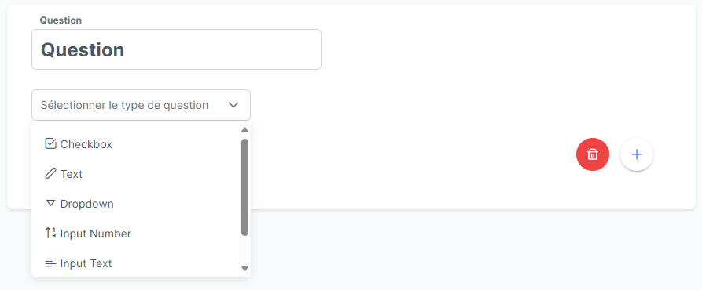

# Vue Form Builder Lib

Vue Form Builder Lib est une librairie Vue.js conçue pour simplifier la création et la réponse à des formulaires dans des applications web.

## Installation

Vous pouvez installer la librairie via npm :

```bash
npm install vue-form-builder-lib
```

## Utilisation

### Création de formulaires

Pour créer un formulaire, utilisez le composant `FormCreator`. Il génère un formulaire avec un titre, une description et un gestionnaire de questions pour ajouter différents types de questions.

```vue
<template>
  <FormCreator @formCreated="handleFormCreated" />
</template>

<script setup lang="ts">
import { ref } from 'vue';
import FormCreator from 'vue-form-builder-lib';
import FormulaireModel from '@/models/FormulaireModel';
import QuestionModel from '@/models/QuestionModel';

const formulaire = ref<FormulaireModel>();

function handleFormCreated(json: { formulaire: FormulaireModel; questions: QuestionModel[] }) {
  formulaire.value = json.formulaire;
  // Traitez les données du formulaire ici
}
</script>
```

L'événement `formCreated` est déclenché lorsqu'un utilisateur soumet le formulaire créé.


### Réponse aux formulaires

Pour répondre à un formulaire, utilisez le composant `RepondreFormulaire`. Il affiche une liste de questions avec la possibilité de répondre à chacune.

```vue
<template>
  <RepondreFormulaire :questions="questions" @questionSubmited="handleReponseSubmitted" />
</template>

<script setup lang="ts">
import { ref } from 'vue';
import RepondreFormulaire from 'vue-form-builder-lib';
import QuestionModel from '@/models/QuestionModel';
import ReponseModel from '@/models/ReponseModel';

const questions = ref<QuestionModel[]>();

function handleReponseSubmitted(reponses: ReponseModel[]) {
  // Traitez les réponses aux questions ici
}
</script>
```

L'événement `questionSubmited` est déclenché lorsque l'utilisateur soumet ses réponses au formulaire.


### Exemple complet d'utilisation

Voici un exemple complet d'utilisation des deux composants dans une application Vue.js :

```vue
<template>
  <div>
    <FormCreator @formCreated="handleFormCreated" />
    <RepondreFormulaire v-if="isSubmited" :questions="questions" @questionSubmited="handleReponseSubmitted" />
  </div>
</template>

<script setup lang="ts">
import { ref } from 'vue';
import FormCreator from 'vue-form-builder-lib';
import RepondreFormulaire from 'vue-form-builder-lib';
import FormulaireModel from '@/models/FormulaireModel';
import QuestionModel from '@/models/QuestionModel';
import ReponseModel from '@/models/ReponseModel';

const formulaire = ref<FormulaireModel>();
const questions = ref<QuestionModel[]>();
const isSubmited = ref(false);

function handleFormCreated(json: { formulaire: FormulaireModel; questions: QuestionModel[] }) {
  formulaire.value = json.formulaire;
  questions.value = json.questions;
  isSubmited.value = true;
}

function handleReponseSubmitted(reponses: ReponseModel[]) {
  // Traitez les réponses aux questions ici
}
</script>
```

## Modèles de données

La librairie utilise les modèles suivants pour représenter les formulaires, les questions et les réponses :

### `FormulaireModel`

```typescript
interface FormulaireModel {
  id?: string;
  titre?: string;
  description?: string;
  creer_par?: UtilisateurModel;
  creerLe?: Date;
  modifieLe?: Date;
}
```

- `id` : Identifiant du formulaire.
- `titre` : Titre du formulaire.
- `description` : Description du formulaire.
- `creer_par` : Utilisateur ayant créé le formulaire.
- `creerLe` : Date de création du formulaire.
- `modifieLe` : Date de dernière modification du formulaire.

### `QuestionModel`

```typescript
interface QuestionModel {
  id?: number;
  formulaire?: FormulaireModel;
  question?: string;
  type_question?: TypeQuestionModel;
  options_question?: string;
}
```

- `id` : Identifiant de la question.
- `formulaire` : Formulaire auquel la question appartient.
- `question` : Libellé de la question.
- `type_question` : Type de la question.
- `options_question` : Options supplémentaires de la question.

### `ReponseModel`

```typescript
interface ReponseModel {
  id?: number;
  formulaire?: FormulaireModel;
  question?: QuestionModel;
  typeReponse?: TypeQuestionModel;
  utilisateur?: UtilisateurModel;
  poster_le?: Date;
  donnees_reponse?: DonneesReponse;
  id_group_reponse?: string;
}
```

- `id` : Identifiant de la réponse.
- `formulaire` : Formulaire auquel la réponse est associée.
- `question` : Question à laquelle la réponse est donnée.
- `typeReponse` : Type de la réponse.
- `utilisateur` : Utilisateur ayant donné la réponse.
- `poster_le` : Date à laquelle la réponse a été soumise.
- `donnees_reponse` : Données de la réponse.
- `id_group_reponse` : Identifiant du groupe de réponse (le cas échéant).

## Types de questions

 pris en charge

La librairie prend en charge plusieurs types de questions, notamment :

- Checkbox
- Texte
- Sélection
- Case à cocher multiple
- Numérique


